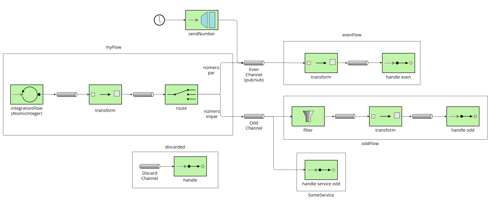
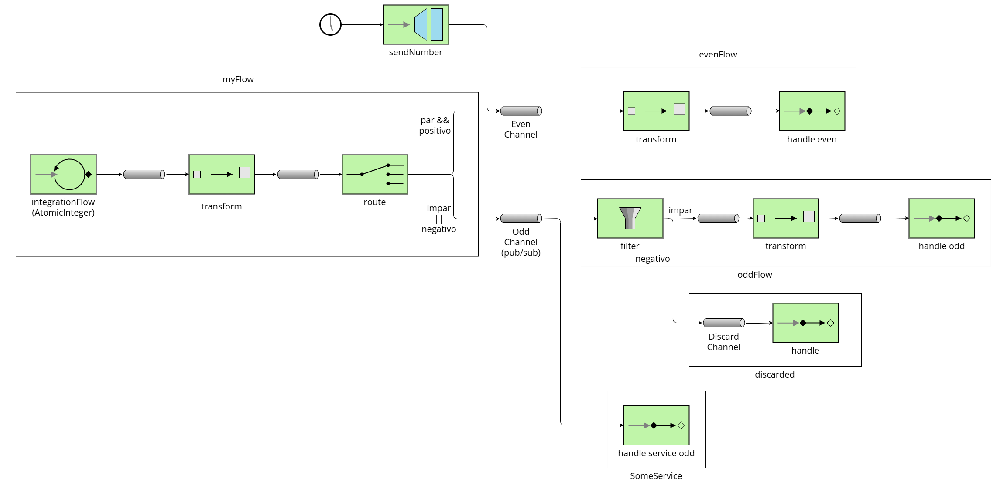
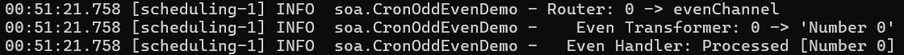
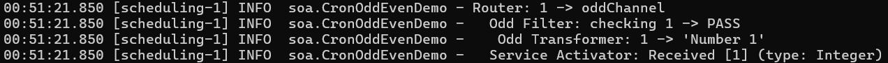
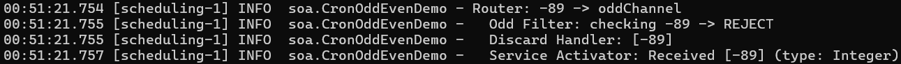
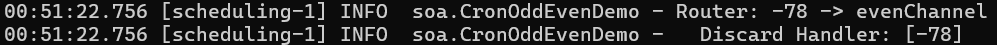

# Lab 5 Integration and SOA - Project Report

**Author:** Ariana Porroche Llorén (874055)

**Date:** 21st November 2025

**Course:** Web Engineering


## 1. EIP Diagram (Before)



The initial code had several problems:
- `evenChannel` was defined as publish/subscribe, but the channel that actually requires publish/subscribe semantics is `oddChannel`.
- `myFlow` was polling messages instead of obtaining them from a channel.
- The filter in `oddFlow` was passing only even numbers, which is incorrect because the flow should receive odd numbers.
- Negative numbers were being sent only to `evenChannel`, instead of being routed appropriately to the correct channels.
- `discarded` flow was isolated and not connected to any channel, so discarded messages would never reach it.



---

## 2. What Was Wrong

### Bug 1:
  - **Problem:** The `evenChannel` was defined as publish/subscribe instead of the `oddChannel`
  - **Reason:** The `oddChannel` must be publish/subscribe because it has multiple subscribers (`oddFlow` and the `@ServiceActivator`). The `evenChannel` only has one subscriber, so it should remain a direct channel
  - **Solution:** Changed the channel name of the channel defined as publish/subscribe:
    
    Old code:
    ```
    @Bean
    fun evenChannel(): PublishSubscribeChannelSpec<*> = MessageChannels.publishSubscribe()
    ```
    New code:
    ```
    @Bean
    fun oddChannel(): PublishSubscribeChannelSpec<*> = MessageChannels.publishSubscribe()
    ```

### Bug 2:
  - **Problem:** `myFlow` wasn't obtaining the messages from a channel
  - **Reason:** As it was designed, `myFlow` should consume messages from a channel, not from a polled source
  - **Solution:** Create a new channel called `numberChannel`, in which we inject the positive numbers that `myFlow` was polling:

    Old code:
    ```
    @Bean
    fun myFlow(integerSource: AtomicInteger): IntegrationFlow =
      integrationFlow(
        source = { integerSource.getAndIncrement() },
        options = { poller(Pollers.fixedRate(100)) },
      ) {
        transform { num: Int ->
          logger.info("📥 Source generated number: {}", num)
          num
        }
        route { p: Int ->
          val channel = if (p % 2 == 0) "evenChannel" else "oddChannel"
          logger.info("🔀 Router: {} → {}", p, channel)
          channel
        }
      }
    ```
    New code:
    ```
    @Bean
    fun numberChannel() = MessageChannels.direct()

    @Bean
    fun myFlow(): IntegrationFlow =
      integrationFlow("numberChannel") {
          route { p: Int ->
            val channel = if (p % 2 == 0) "evenChannel" else "oddChannel"
            logger.info("Router: {} -> {}", p, channel)
            channel
          }
      }
    
    private val positiveCounter = AtomicInteger(0)

    @Scheduled(fixedRate = 100)
    fun sendPositiveNumber() {
      val number = positiveCounter.getAndIncrement()
      logger.info("Source generated number: {}", number)
      sendNumber.sendNumber(number)
    }
    ```

### Bug 3:
  - **Problem:** The `oddFlow` wasn't passing odd numbers
  - **Reason:** The filter incorrectly checked `p % 2 == 0`, which only matches even numbers. Since `oddFlow` receives only odd numbers, the condition always failed and all messages were discarded
  - **Solution:** Change the filter, so it pass just positive numbers

    Old code:
    ```
    @Bean
    fun oddFlow(): IntegrationFlow =
      integrationFlow("oddChannel") {
          filter { p: Int ->
            val passes = p % 2 == 0
            logger.info("  🔍 Odd Filter: checking {} → {}", p, if (passes) "PASS" else "REJECT")
            passes
    ...
    ```
    New code:
    ```
    @Bean
    fun oddFlow(): IntegrationFlow =
      integrationFlow("oddChannel") {
          filter({ p: Int ->
            val passes = p > 0
            logger.info("  Odd Filter: checking {} -> {}", p, if (passes) "PASS" else "REJECT")
            passes
    ...
    ```

### Bug 4:
  - **Problem:** Negative numbers weren't being sent to the right channel
  - **Reason:** Negative numbers were being sent to `evenChannel`, instead of being sent to both channels `evenChannel` and `oddChannel`
  - **Solution:** Change the `requestChannel` were the function was injecting the numbers from `evenChannel` to the recently created `numberChannel`

    Old code:
    ```
    @MessagingGateway
    interface SendNumber {
      @Gateway(requestChannel = "evenChannel")
      fun sendNumber(number: Int)
    }
    ```
    New code:
    ```
    @MessagingGateway
    interface SendNumber {
      @Gateway(requestChannel = "numberChannel")
      fun sendNumber(number: Int)
    }
    ```

### Bug 5:
  - **Problem:** `discard` flow wasn't receiving any message
  - **Reason:** No channel was conected `discard` flow, so it was unreachable. The rejected messages were being lost
  - **Solution:** In `oddFlow`, send the messages that don't pass the filter to `discardChannel`, and also in the `evenFlow`

    Old code:
    ```
    @Bean
    fun evenFlow(): IntegrationFlow =
      integrationFlow("evenChannel") {
    ...

    @Bean
    fun oddFlow(): IntegrationFlow =
      integrationFlow("oddChannel") {
        filter { p: Int ->
          val passes = p % 2 == 0
          logger.info("  🔍 Odd Filter: checking {} → {}", p, if (passes) "PASS" else "REJECT")
          passes
        } // , { discardChannel("discardChannel") })
    ...
    ```
    New code:
    ```
    @Bean
    fun evenFlow(): IntegrationFlow =
      integrationFlow("evenChannel") {
          filter({ p: Int ->
            val passes = p >= 0
            passes
          }, { discardChannel("discardChannel") })
    ...

    @Bean
    fun oddFlow(): IntegrationFlow =
      integrationFlow("oddChannel") {
        filter({ p: Int ->
          val passes = p > 0
          logger.info("  Odd Filter: checking {} -> {}", p, if (passes) "PASS" else "REJECT")
          passes
        }, { discardChannel("discardChannel") })
    ...
    ```


---

## 3. Results

The loggs obtained from the execution of the aplication were:

### 3.1. Positive even number:


### 3.2. Positive odd number:


### 3.3. Negative odd number:


### 3.4. Negative even number:


---

## 4. What You Learned

In this lab, I gained a clearer understanding of how Enterprise Integration Patterns structure message-driven systems. I learned how channels, filters, routers, and service activators work together, and how concepts like publish/subscribe channels and discard flows influence message routing.

I also understood how Spring Integration implements these patterns in a modular and declarative way, where each step in the flow has a single responsibility. Distinguishing between direct channels, publish/subscribe channels, and message gateways was especially helpful.

The most challenging part was identifying how small configuration mistakes broke the flow. By analysing logs and tracking how messages moved through the channels, I was able to understand the underlying issues and fix the integration pipeline.

---

## 5. AI Disclosure

I used AI tools (ChatGPT) to assist me during the development of the report. The tool helped me refine explanations, improve the clarity of the text, and better articulate the reasoning behind some of the fixes. However, all the debugging, the understanding of the flows, and the implementation of the corrected code were done by me. I used AI only as a writing assistant to improve the presentation of my findings, not to solve the assignment itself.

---

## Additional Notes

Implemented the next 3 bonus tasks:

### 1. Content Enricher Pattern

### 3. Dead Letter Channel

### 4. Wire Tap
